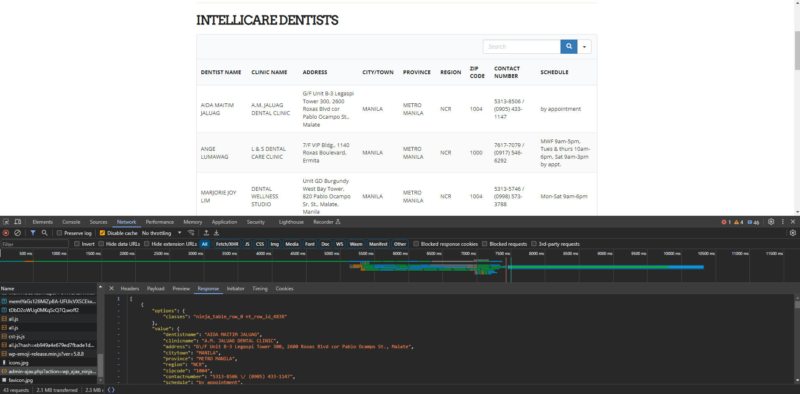

# Intellicare-Affiliated Dentists List

The objective of this activity is to get all dentists from the table using python and convert it to csv

Initially, this would be parsed by using beautiful soup. However, this activity shows that some sites don't need to be scraped. We just need to be mindful of the resources being fetched by the site.

## Steps

1. Open the [site](http://dnc.com.ph/) on browser.
2. Right click on the page and click "Inspect."
3. Go to the Network tab.
4. Refresh the page.
5. Check if there is a file that returns a json object that contains table data.

6. Copy this data and save as a local json file, perform cleaning and convert to csv.

